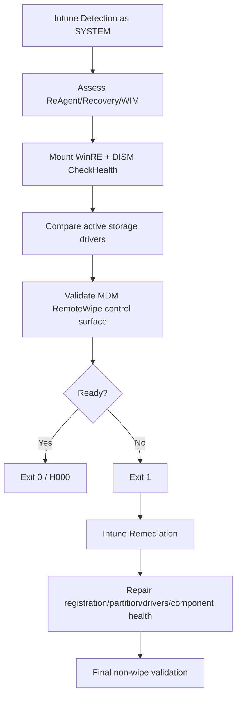
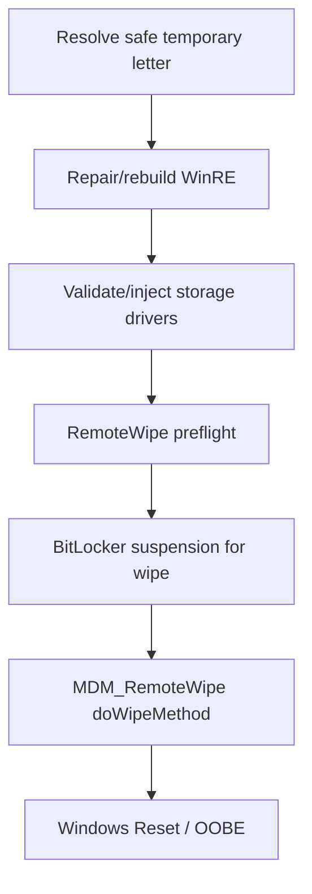
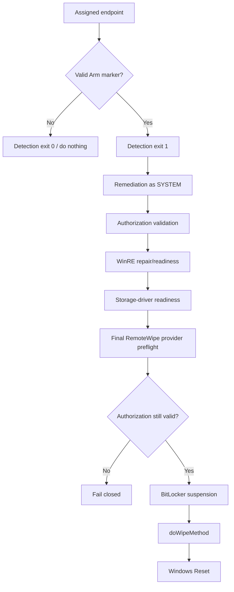

# Architecture

## Three workflows, shared principles

The project uses a common set of design principles:

- Reassess real state on every run rather than trusting a prior status flag.
- Stage a known WinRE image before destructive partition work.
- Shrink C: only by the additional capacity currently required.
- Reuse partial previous work where safe.
- Validate active third-party storage-driver coverage inside WinRE.
- Treat BitLocker changes as short-lived, scoped operations.
- Validate the RemoteWipe provider before changing BitLocker for a wipe.
- Fail closed on ambiguous storage states.

## Intune readiness

## ConfigMgr carve-out

## Intune carve-out reset

The dependent repair and destructive steps remain in one remediation script because independently scheduled Remediations packages do not provide a reliable cross-package execution order.

